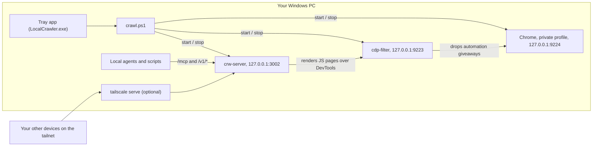

# local-crawl

[](https://github.com/gourneau/local-crawl/actions/workflows/ci.yml)

Run the [fastCRW](https://github.com/fastcrw/crw) web crawler natively on Windows, with no Docker and no WSL. You get:

- A **system tray on/off switch**.
- **JavaScript rendering** through your installed Chrome or Edge.
- An **MCP server** your AI agents can use.
- Optional sharing to your **other devices over Tailscale**.

## Features

- **Native and light.** fastCRW is a single Rust binary. On a test machine it idled at about 10–30 MB of RAM.
- **Firecrawl-compatible API.** `/v1/scrape`, `/v1/crawl` and `/v1/map` return clean markdown, so Firecrawl SDKs work against it.
- **MCP built in.** Claude Code, Cursor, VS Code and other MCP clients can scrape, crawl and map through it.
- **JS pages just work.** Plain pages are fetched over HTTP. Single-page apps are rendered in Chrome automatically.
- **Looks like a real browser.** Chrome runs as a real window parked off-screen, not headless. A small filter strips crw's automation giveaways, so websites see a genuine Chrome on Windows. See [How it looks to websites](#how-it-looks-to-websites).
- **Optional Docker engine.** Adds web search (SearXNG), a Chrome-grade HTTP fallback (`impersonated-http`) and Camoufox, on top of the same real Chrome. See [Engines](#engines-local-or-docker).
- **Tray app.** Green means running, gray means stopped. Start, stop, restart, view logs, switch engines, and switch to a visible browser for debugging.
- **Private by default.** Everything listens on `127.0.0.1` only. One Tailscale command shares it with your own devices, and nothing else.

## How it works



- `crawl.ps1` does all the work. The tray app is a small C# front end that calls it and polls the health endpoints.
- Chrome runs with its own throwaway profile in `.chrome-profile\`, separate from your everyday browser. The scripts only ever stop the Chrome that uses that profile.
- `cdp-filter` sits between crw and Chrome. It is a small C# DevTools proxy built from `filter\CdpFilter.cs`. See below for what it does.

## How it looks to websites

Out of the box, crw's browser has the same kind of telltale signs as Playwright or Puppeteer. This setup removes them in three ways.

**1. A real window, not headless.** By default Chrome runs as a normal window parked off-screen. It's kept out of the taskbar and Alt+Tab, and it never takes keyboard focus. Websites see a real desktop browser with a real screen, taskbar, GPU and plugins. Headless mode is still available, but some sites block it outright. In testing, G2 blocked headless Chrome and allowed the same Chrome as an off-screen window.

**2. No fake disguise.** crw normally injects a script that pretends to be a Mac with Intel graphics and patches browser properties. Fingerprinting scripts catch those lies. For example, CreepJS flagged `hasBadWebGL` and `hasToStringProxy`. The filter drops that script, so Chrome reports its true values:
- `navigator.webdriver` is genuinely false, because Chrome starts with `--disable-blink-features=AutomationControlled`.
- WebGL reports the real GPU.
- Chrome's client hints stay intact. crw's User-Agent override is dropped too, because it blanks them.

**3. No automation tells over DevTools.** The filter also drops two commands crw sends:
- `Runtime.enable`, the best-known way pages detect Puppeteer and Playwright.
- `Fetch.enable`, which makes Chrome pause every request for crw to approve, so pages load like a normal visit without it.

crw works fine without both. The filter logs every DevTools command crw sends to `logs\cdp-filter.log`, so you can audit it yourself.

crw's plain HTTP fetch, used before falling back to Chrome, sends the browser's real User-Agent rather than crw's default "Chrome 150 on a Mac".

Measured with the crawler itself, on Chrome 154 on Windows:

| Test | crw default (headless, own disguise) | This setup |
|---|---|---|
| [bot.sannysoft.com](https://bot.sannysoft.com) | 23 / 24 | **31 / 31** |
| [CreepJS](https://abrahamjuliot.github.io/creepjs/) headless | 67% | **0%** |
| CreepJS stealth (detected lies) | 40% | **0%** |
| CreepJS "like headless" | 31% | 19%, from Android-only APIs every desktop Chrome lacks |
| [stealthcheck.io](https://stealthcheck.io/test) | not measured | 92 / 100 "Excellent", 0 critical |
| `navigator.webdriver` | true (detected) | false |
| WebGL | fake Intel Iris (detected) | real GPU |

## Engines: local or Docker

There are two ways to run it. Switch in the tray (**Options → Local engine / Docker engine**) or with `.\crawl.ps1 restart -Engine docker`. Both serve the same API on the same port, so MCP clients and Tailscale don't notice the switch.

| | Local engine | Docker engine (hybrid) |
|---|---|---|
| Needs | Windows only | Docker Desktop, plus `.\setup.ps1 -Docker` once |
| Plain HTTP fetch | crw's own TLS (not Chrome-like) | same, **plus** a fallback with real Chrome's TLS and HTTP/2 fingerprint (`impersonated-http`) when a site walls the plain fetch |
| JavaScript pages | your real Chrome, through the filter | the same real Chrome, through the same filter |
| Last resort | none | **Camoufox**, an anti-detect Firefox |
| Web search (`/v1/search`, `crw_search`) | no | **yes** (SearXNG) |
| Extra memory | none | about 1–2 GB for the containers |

The Docker engine is fastCRW's [self-hosting stack](https://docs.fastcrw.com/self-hosting/), rebuilt with the Camoufox tier compiled in. Its Chrome tier points at your PC's real Chrome instead of fastCRW's browsers, because that measured far better:

| Chrome tier (same tests as above) | sannysoft | CreepJS headless / stealth | stealthcheck | rebrowser leaks |
|---|---|---|---|---|
| **Your real Chrome + filter** (both engines) | **31 / 31** | **0% / 0%** | **92** | none |
| fastCRW's browserless "stealth" Chrome | 28 / 31 | 67% / 80% | 25 | 3 detected |
| fastCRW's LightPanda | 25 / 30 | (falls back) | (falls back) | (falls back) |
| Camoufox (Docker engine's last tier) | 9 / 10 | 0% / 0% | n/a (Firefox) | none |

Network fingerprint ([tls.peet.ws](https://tls.peet.ws/api/all)):

| Fetch | JA4 | HTTP/2 fingerprint | Looks like Chrome? |
|---|---|---|---|
| crw plain HTTP (both engines) | `t13d1011h2_61a7ad8aa9b6_…` | `9b5dcd07…` | no |
| `impersonated-http` (Docker engine) | `t13d1516h2_8daaf6152771_…` | `52d84b11…` | **yes** |
| Chrome (both engines) | genuine | genuine | yes, it is Chrome |

browserless and LightPanda are still in `docker\compose.yml` as optional `extras`.

## Requirements

- Windows 10 or 11 (x64 or ARM64)
- Google Chrome or Microsoft Edge, for JavaScript-heavy pages
- Windows PowerShell 5.1 (built into Windows)
- Optional: [Tailscale](https://tailscale.com), to use the crawler from other devices
- Optional: [Docker Desktop](https://www.docker.com/products/docker-desktop/), for the Docker engine (search, Chrome-grade HTTP fetching, Camoufox)

The tray app is compiled with the C# compiler that ships with Windows (.NET Framework 4.x). There is nothing extra to install.

## Quick start

```powershell
git clone https://github.com/gourneau/local-crawl.git
cd local-crawl
.\setup.ps1           # downloads fastCRW and verifies its SHA-256 checksums
.\tray\install.ps1    # builds the tray app and adds Desktop + Start Menu shortcuts
.\setup.ps1 -Docker   # optional: prepares the Docker engine (~15 min the first time)
```

A globe icon appears in the system tray. Click it, then choose **Start crawler**. Test it:

```powershell
.\crawl.ps1 scrape https://example.com
```

If you don't want the tray app, skip `tray\install.ps1` and use `.\crawl.ps1 start` instead.

## The tray app

| Icon | Meaning |
|---|---|
| Green | Running |
| Gray | Stopped |
| Amber | Starting or stopping, or running with the browser closed (use **Restart**) |

Left- or right-click the icon for the menu:

- **Start / Stop crawler** and **Restart**
- **Options** chooses the browser mode: **Hidden window (most realistic)**, **Visible window (for debugging)** or **Headless (lightest, easiest to detect)**. The tray remembers the choice.
- **Show live log** opens a console window that follows the server log.
- **Open logs folder**, **Open crawler folder**, **Copy API URL**
- **Exit** asks whether to stop the crawler or leave it running in the background.

Windows 11 hides new tray icons by default. Click `^` on the taskbar to find it, or turn it on under **Settings → Personalization → Taskbar → Other system tray icons**.

The source is in `tray\`. After editing it, run `.\tray\install.ps1` again. Use `-BuildOnly` to skip the shortcuts.

## Command line

```powershell
.\crawl.ps1 start            # start Chrome + crw-server, wait until healthy
.\crawl.ps1 start -Browser visible    # same, with an on-screen browser window
.\crawl.ps1 start -Browser headless   # no window at all (lightest, easiest to detect)
.\crawl.ps1 status           # running? healthy? memory? browser mode?
.\crawl.ps1 stop
.\crawl.ps1 restart          # add -Browser <mode> to switch modes
.\crawl.ps1 logs             # follow logs\crw-server.log
.\crawl.ps1 scrape <url>     # print one page as markdown
```

`start.cmd` and `stop.cmd` do the same as `start` and `stop` when double-clicked. Nothing starts at login unless you set that up yourself.

## Using the REST API

The base URL is `http://127.0.0.1:3002`. No API key is needed locally.

```powershell
# One page to markdown (Windows PowerShell 5.1 quoting; in PowerShell 7 drop the backslashes)
curl.exe -s http://127.0.0.1:3002/v1/scrape -H "Content-Type: application/json" -d '{\"url\":\"https://example.com\"}'
```

| Endpoint | Body example | What it does |
|---|---|---|
| `POST /v1/scrape` | `{"url":"https://example.com"}` | One page as markdown, HTML, links, or a screenshot |
| `POST /v1/scrape` | `{"url":"...","renderJs":true}` | Force Chrome rendering for a single-page app |
| `POST /v1/map` | `{"url":"https://example.com","limit":50}` | Discover a site's URLs |
| `POST /v1/crawl` | `{"url":"...","limit":20,"maxDepth":2}` | Start an async crawl and return a job id |
| `GET /v1/crawl/<id>` | | Poll a crawl job for status and pages |
| `GET /v1/capabilities` | | What this server supports |

See the [fastCRW API docs](https://docs.fastcrw.com/) for the full set of options.

## Connecting AI agents (MCP)

The MCP endpoint is `http://127.0.0.1:3002/mcp`, using the streamable HTTP transport.

**Claude Code on the same PC.** This also covers the **Code** tab of the Claude desktop app, which reads the same user config (`%USERPROFILE%\.claude.json`):

```powershell
claude mcp add --scope user --transport http crw http://127.0.0.1:3002/mcp
```

If `claude` isn't on your PATH because you only have the desktop app, it ships a copy at `%APPDATA%\Claude\claude-code\<version>\<id>\claude.exe`.

**Claude Desktop chat on the same PC.** Its config file only takes stdio servers, so use the bundled `crw-mcp.exe` bridge (no Node.js needed). Add this to `%APPDATA%\Claude\claude_desktop_config.json`, keeping whatever else is in the file, and change the path to where you cloned the repo:

```json
{
  "mcpServers": {
    "crw": {
      "command": "C:\\path\\to\\local-crawl\\bin\\crw-mcp.exe",
      "args": ["--api-url", "http://127.0.0.1:3002", "--hide-credits"]
    }
  }
}
```

Then fully quit Claude (tray icon → **Quit**) and reopen it.

Agents get these tools: `crw_scrape`, `crw_crawl`, `crw_check_crawl_status`, `crw_map`, `crw_extract`, `crw_check_extract_status`, `crw_cancel_extract` and `crw_parse_file`, plus `crw_search` with the Docker engine.

For any other client that only supports stdio MCP, use the same `crw-mcp.exe` command.

## Telling Claude to use it

Claude has its own web fetch. You need to tell it to read pages with crw instead.

**Why bother?** Claude's built-in fetch identifies itself as `Claude-User`, doesn't run JavaScript, and refuses some domains outright. crw looks like a normal Chrome browser. In one side-by-side test on bot-protected sites (Reddit, Zillow, Glassdoor, Amazon, NYT), the built-in fetch read 0 of 5 and crw read all 5.

With the local engine, crw has no search tool, so let Claude keep its built-in web search for finding pages. The Docker engine adds `crw_search`, but built-in search works fine either way.

**Minimal version.** One line is enough:

```markdown
To read web pages, use the crw MCP tools (`crw_scrape`; `crw_map`/`crw_crawl` for many pages) instead of the built-in web fetch. crw gets through sites that block the built-in fetcher. Keep using built-in web search to find pages.
```

**Fuller version,** with usage tips:

```markdown
## Web research

Finding pages and reading pages use different tools:

- **Finding pages:** use your built-in web search. If it's unavailable, use `crw_search` (Docker engine only). Never use crw to load search-engine result pages (Google, Bing, DuckDuckGo, etc.).
- **Reading pages:** use the crw MCP tools instead of the built-in web fetch. crw returns the full page as clean markdown and can render JavaScript.
  - `crw_scrape` reads one URL. If the result is empty, missing content, or a short interstitial ("continue shopping", "verify you are human", "just a moment"), retry with `renderJs: true`. Output is cut at about 15,000 characters; raise `maxLength` only if you need the rest.
  - `crw_map` lists a site's URLs without fetching them. Use it to pick pages, then scrape only those.
  - `crw_crawl` fetches many pages from one site. It returns a job id; poll `crw_check_crawl_status` with it for the results. Keep `maxPages` at 20 or fewer unless I ask for more (the default is 10).
- If the crw tools can't connect, say so, then use the built-in web fetch instead.
```

**Where to put it:**

| App | Where |
|---|---|
| Claude Code | `~/.claude/CLAUDE.md` (macOS/Linux) or `%USERPROFILE%\.claude\CLAUDE.md` (Windows). Applies to every project. |
| Claude Desktop | **Settings → Profile**, in the personal preferences box, or a Project's instructions. Also turn on web search in the chat's tools menu. |
| Other agents | Their system prompt or rules file, such as Cursor rules or `AGENTS.md` |

## Sharing with your other devices (Tailscale)

[Tailscale Serve](https://tailscale.com/kb/1312/serve) forwards traffic from your tailnet to the crawler. crw-server still only listens on `127.0.0.1`, so it isn't exposed to your LAN or the internet, and no firewall changes are needed.

**1. On the Windows PC, run this once.** It stays on across reboots:

```powershell
& "C:\Program Files\Tailscale\tailscale.exe" serve --bg --http=3002 3002
```

**2. Find the PC's tailnet name.** It's shown by `tailscale status` and in the Tailscale admin console. The full name looks like `your-pc.your-tailnet.ts.net`. Replace `your-pc.your-tailnet.ts.net` below with yours.

**3. Point your other devices at it.**

Quick test from another device. It should print `200`:

```sh
curl -s -o /dev/null -w "%{http_code}\n" http://your-pc.your-tailnet.ts.net:3002/health
```

| Client | Setup |
|---|---|
| **Claude Code** | `claude mcp add --scope user --transport http crw http://your-pc.your-tailnet.ts.net:3002/mcp` |
| **Cursor** (`~/.cursor/mcp.json`) | `{"mcpServers": {"crw": {"url": "http://your-pc.your-tailnet.ts.net:3002/mcp"}}}` |
| **VS Code** (`.vscode/mcp.json`) | `{"servers": {"crw": {"type": "http", "url": "http://your-pc.your-tailnet.ts.net:3002/mcp"}}}` |
| **Firecrawl SDKs / scripts** | Base URL `http://your-pc.your-tailnet.ts.net:3002` |

**Claude Desktop** custom connectors connect from Anthropic's cloud, which can't reach a tailnet. Use the [`mcp-remote`](https://github.com/punkpeye/mcp-remote) bridge instead, which needs Node.js. Add this to `claude_desktop_config.json`. On macOS, that file is in `~/Library/Application Support/Claude/`.

```json
{
  "mcpServers": {
    "crw": {
      "command": "npx",
      "args": ["-y", "mcp-remote", "http://your-pc.your-tailnet.ts.net:3002/mcp", "--allow-http"]
    }
  }
}
```

Then fully quit and reopen Claude Desktop. If it can't find `npx`, use the full path that `which npx` prints.

Good to know:

- **Plain `http` is fine here.** Tailscale encrypts the traffic between devices. If a client insists on `https`, turn on HTTPS certificates in the Tailscale admin console and serve with `--https=443` instead.
- **The crawler must be running** (tray icon green). Otherwise remote clients get errors.
- **There's no API key**, so every device on your tailnet can use it. If you share your tailnet, add `[auth] api_keys` in `config.local.toml`.
- **To stop sharing:** `& "C:\Program Files\Tailscale\tailscale.exe" serve reset`

### From your phone

The Claude mobile app can't connect to the crawler directly. Its custom connectors are called from Anthropic's cloud, and the cloud can't reach a tailnet address.

Use [Remote Control](https://code.claude.com/docs/en/remote-control) instead. It lets you drive a Claude Code session that runs on the PC, so the session uses the PC's MCP servers, crw included. It needs a Pro, Max, Team or Enterprise plan.

1. On the PC, turn it on once. In the desktop app's settings, turn on **Connect new sessions to Remote Control**. In a terminal, run `claude remote-control` instead.
2. Start a session on the PC, in the app's **Code** tab or the terminal.
3. On the phone, open the Claude app (signed in to the same account) and open that session from its Claude Code sessions. Ask it to read a page and it uses `crw_scrape` on the PC.

The phone needs no Tailscale for this, and the PC must stay awake with the crawler running. Exposing the crawler to the internet with Tailscale Funnel would let the cloud reach it, but crw would then be an open web proxy for anyone who finds the URL, so don't do that without an API key.

## Debugging with a visible browser

Choose **Options → Visible window (for debugging)** in the tray, or run `.\crawl.ps1 restart -Browser visible`. Chrome opens on screen, and pages crw renders appear as tabs, so you can watch what a site does.

If you close that window, Chrome exits. JS pages then stop rendering until you click **Restart**. Plain HTML pages still work. The tray turns amber when this happens.

## Configuration

| What | Where |
|---|---|
| API and browser ports (default `3002`, `9223`) | Top of `crawl.ps1`. The tray app reads them from there. |
| robots.txt, request rate, concurrency, render timeouts | `config.local.toml` |
| Which browser to use | `$env:CRW_BROWSER`, else Chrome for Testing in `browser\chrome-win64\`, else installed Chrome, else Edge |
| Engine (local / docker) | Tray **Options**, or `-Engine` on `crawl.ps1` (default: whichever was last running, else `local`) |
| Docker engine settings | `docker\config.docker.toml`, `docker\compose.yml`, `docker\searxng\settings.yml` |
| Browser mode (hidden / visible / headless) | Tray **Options**, or `-Browser` on `crawl.ps1` (default `hidden`) |
| DevTools commands the filter swallows | `$FilterDrop` at the top of `crawl.ps1` (default `Runtime.enable`), or `$env:CRAWL_FILTER_DROP` |
| fastCRW version | `.\setup.ps1 -Version x.y.z` (stop the crawler first) |

The defaults are polite: robots.txt is respected, with 3 requests per second and 5 concurrent requests.

crw's limit on *incoming* API requests is turned off (`rate_limit_rps = 0`). Its default of 10 per second is shared by all clients. MCP apps like Claude Desktop open several connections at once on startup, and some were refused with HTTP 429. This doesn't change how fast sites are crawled. The full option list is in the [fastCRW configuration docs](https://docs.fastcrw.com/configuration/).

**Optional: a browser that never updates itself.** Your installed Chrome updates itself and may show update prompts in visible mode. To pin a version instead, download `chrome-win64.zip` from [Chrome for Testing](https://googlechromelabs.github.io/chrome-for-testing/) and unzip it so that `browser\chrome-win64\chrome.exe` exists. The scripts use it automatically.

## Troubleshooting

| Symptom | Cause / fix |
|---|---|
| Pages are slow, or fall back to Chrome often | crw's direct HTTP fetch has a hardcoded 2.5 s connect timeout, so a weak Wi-Fi link misses it. Pages still come back via Chrome, just slower. A better connection fixes it. |
| Garbled characters (`é`, `’`) in PowerShell | Windows PowerShell 5.1's `Invoke-RestMethod` decodes this API as Latin-1. Use `curl.exe`, PowerShell 7, or `.\crawl.ps1 scrape`. |
| "Port 3002 is already used by …" | Another app has the port. Change `$ApiPort` at the top of `crawl.ps1`. |
| Tray icon is amber while running | The browser was closed. Click **Restart**. |
| A page comes back as a short "continue shopping" or "just a moment" page | That's a bot wall the plain HTTP fetch didn't get past. Retry with `"renderJs": true` (Amazon product pages often need this). |
| A site blocks every request, even ones that used to work | Your IP has been flagged, often after many requests in a short time. Wait a while, then slow down. |
| `/v1/search` returns 503, or there's no `crw_search` tool | Search needs the Docker engine, which runs SearXNG. |
| Search returns few or no results | Search engines rate-limit and CAPTCHA self-hosted SearXNG. The config enables extra engines; in testing, Bing kept answering while others were suspended. Suspensions lift after a while. |
| `json` / `summary` formats or `/v1/extract` fail | They need an LLM API key in `[extraction.llm]`. |

The logs are in `logs\`: `crw-server.log`, plus `browser.log` for Chrome.

## Project layout

```
crawl.ps1           start / stop / status / logs / scrape
setup.ps1           downloads + verifies the fastCRW binaries into bin\
config.local.toml   crawler settings (crw loads it from this folder)
start.cmd, stop.cmd double-click wrappers
tray\               tray app source (C#) and install.ps1
filter\             DevTools filter source (C#), built into bin\cdp-filter.exe by setup.ps1
docker\             the Docker engine: compose.yml, crw config, SearXNG settings
bin\                fastCRW binaries (created by setup.ps1, not committed)
logs\, run\         logs and process state (not committed)
.chrome-profile\    the crawler's private Chrome profile (not committed)
```

## Uninstall

1. Choose **Exit** in the tray, and answer **Yes** to stop the crawler. Or run `.\crawl.ps1 stop`.
2. If you shared it over Tailscale, run `tailscale serve reset`.
3. If you used the Docker engine, remove its images: `docker image rm local-crawl/crw:0.37.2-stealth ghcr.io/jo-inc/camofox-browser searxng/searxng:2026.5.9-0cba32c15`.
4. Delete the `Local Crawler` shortcuts from the Desktop and Start Menu, then delete this folder.

## Credits and license

- [fastCRW](https://github.com/fastcrw/crw) does the actual crawling. It is licensed AGPL-3.0. This repo doesn't include its binaries; `setup.ps1` downloads them from fastCRW's official GitHub releases and checks them against the published SHA-256 checksums.
- The Docker engine also uses [Camoufox](https://github.com/daijro/camoufox) via [camofox-browser](https://github.com/jo-inc/camofox-browser) (its crash telemetry is turned off) and [SearXNG](https://github.com/searxng/searxng) (AGPL-3.0).
- The scripts, tray app and filter in this repo are MIT licensed; see [LICENSE](LICENSE).

The configs ignore robots.txt (`respect_robots_txt = false`), but keep a modest request rate of 3 per second per site. Please respect site terms. Heavy crawling from a home IP can get that IP rate-limited or blocked.
